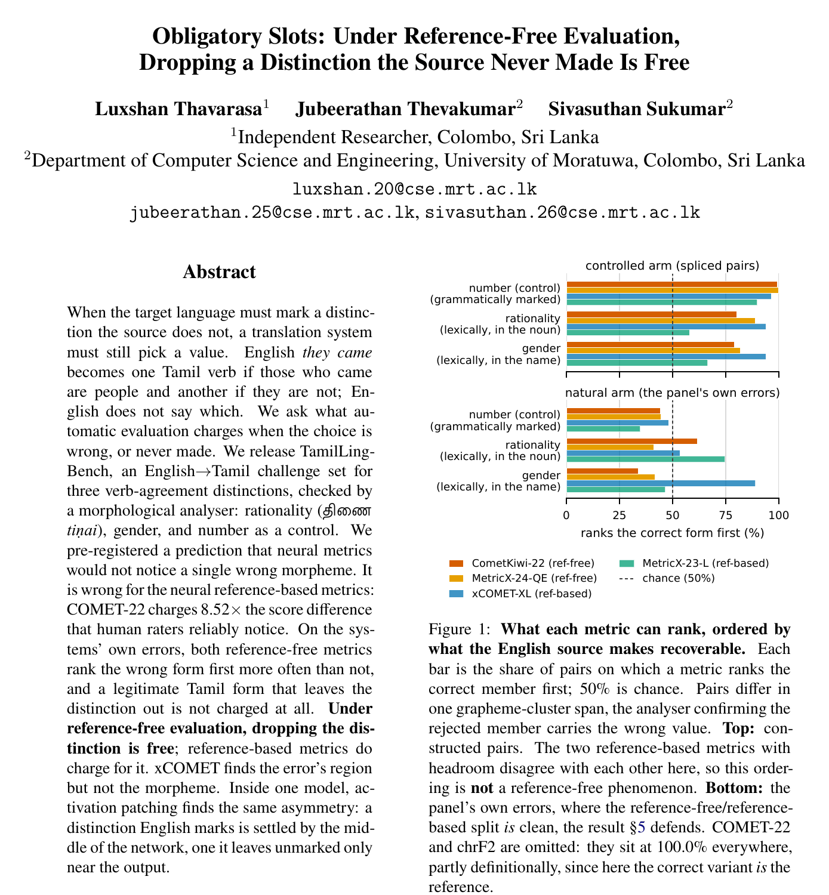
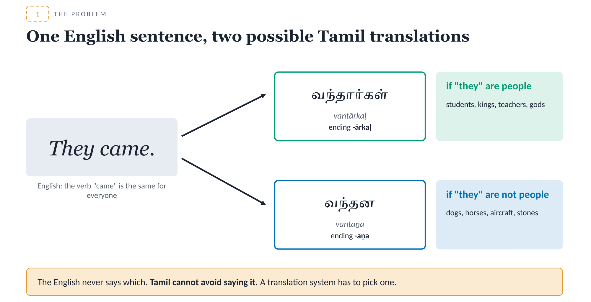
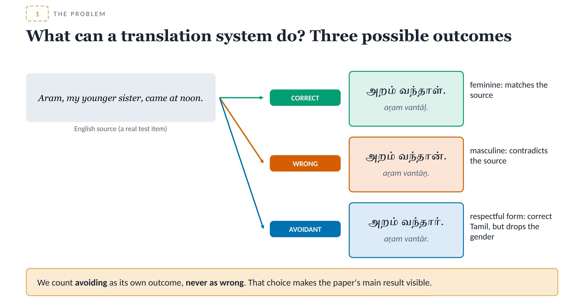
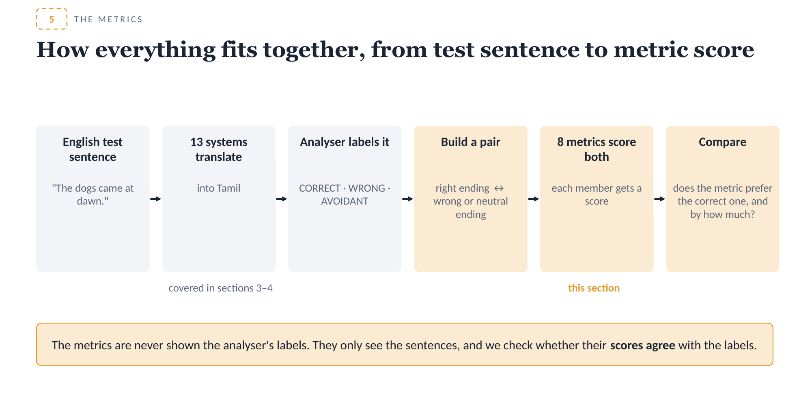
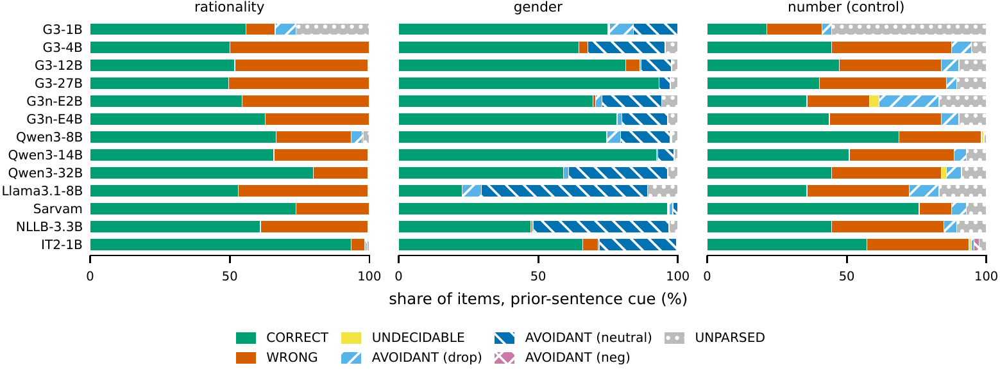

<div align="center">

# TamilLingBench

### Obligatory Slots: Under Reference-Free Evaluation, Dropping a Distinction the Source Never Made Is Free

**Luxshan Thavarasa**<sup>1</sup> · **Jubeerathan Thevakumar**<sup>2</sup> · **Sivasuthan Sukumar**<sup>2</sup>

<sup>1</sup>Independent Researcher, Colombo, Sri Lanka &nbsp;&nbsp; <sup>2</sup>Department of Computer Science and Engineering, University of Moratuwa, Sri Lanka

*WMT 2026: Eleventh Conference on Machine Translation*

[](#citation)
[](presentation/Obligatory_Slots_explained.pdf)
[](LICENSE)
[](LICENSE-DATA.md)
[](.python-version)

</div>

<p align="center">
  
</p>

TamilLingBench is an English→Tamil challenge set for agreement that Tamil requires and English
leaves out. This repository holds the benchmark, the morphological checker that scores it, the
outputs of the 13 translation systems evaluated in the paper, and the scripts and result files
behind its numbers.

**New to the topic?** Start with the [95-slide explainer](presentation/Obligatory_Slots_explained.pdf)
([PowerPoint](presentation/Obligatory_Slots_explained.pptx)). It assumes no background in Tamil or
in MT evaluation and walks through the whole paper with examples.

---

## The problem

English *they came* has two Tamil translations. If the people who came are human, the verb is
வந்தார்கள் *vantārkaḷ*; if they are animals or things, it is வந்தன *vantaṉa*. English never says
which, but a Tamil verb has to pick one. We call such a choice an *obligatory slot*: every
well-formed translation commits to a value the source does not determine.

<p align="center">
  
</p>

A system can get the value right, get it wrong, or avoid it with a form that leaves the
distinction out. The benchmark counts avoidance as its own outcome, never as an error.

<p align="center">
  
</p>

The question the paper asks is simple: when the choice is wrong, or never made, does automatic
evaluation notice?

## Main findings

- Reference-based neural metrics do charge for a wrong choice. COMET-22 charges 8.52 times
  the score difference that human raters reliably notice. This falsified our own pre-registered
  prediction that neural metrics would not notice a single wrong morpheme.
- Reference-free metrics do not. On the errors the systems actually make, CometKiwi-22 and
  MetricX-24-QE rank the wrong form first more often than not, and a legitimate Tamil form that
  leaves the distinction out is not charged at all. Under reference-free evaluation, dropping the
  distinction is free.
- xCOMET finds the region of the error but not the morpheme itself.
- Context makes systems commit without making them right. Moving the clue into the previous
  sentence raises rationality commitment on 12 of 13 systems while accuracy among committed items falls.
- Inside one model (Gemma 3 4B), activation patching shows the same asymmetry: a distinction
  English marks is settled by the middle of the network, one it leaves unmarked only near the
  output.

How the metric study fits together:

<p align="center">
  
</p>

Outcomes per system when the clue is in the previous sentence (Figure 2 in the paper):

<p align="center">
  
</p>

## What is in this repository

```
data/benchmark/        the benchmark: items.jsonl (+ TSV), one file per slot and condition, manifest.json
data/lexicon/          names, nouns, verbs, pronouns, context sentences and cue phrases
templates/             the template families behind the public items
tamillingbench/        Python package
  morph/               MorphChecker: ThamizhiMorph FST analyser plus fallback rules and repairs
  eval/                output scoring (CORRECT / WRONG / AVOIDANT / UNDECIDABLE / UNPARSED)
  gen/                 template loading and validation, FST generation, source/gold audit
  metrics/             metric-study statistics and minimal-pair surgery
  corpus/              corpus attestation and the Tamil corpus prior
scripts/               setup, generation, scoring, analysis, metric study, interpretability
configs/               the 13 panel systems, prompts and decoding settings
outputs/               raw translations, scored records, run manifests, metric-study inputs and scores
results/               machine-readable results behind the paper's numbers
tests/                 pytest suite
presentation/          the explainer slides (PDF and PowerPoint)
docs/DECISIONS.md      design decisions and native-speaker rulings cited by ID in the code and data
```

## The benchmark

`data/benchmark/items.jsonl` holds 2,873 items. Each gives an English source and the Tamil forms
that realise each value of one slot, in one of four conditions that move the clue around:

| Condition | Where the clue is |
|---|---|
| C0 | the instruction names the required form (a capability check) |
| C1 | in the same sentence |
| C2 | in the previous sentence |
| C3 | nowhere: the source is genuinely cue-free, so there is no right answer, only a default |

The paper reports three slots on the verb: rationality (திணை *tiṇai*, whether the subject is a
person), gender, and number as a control. The file also contains honorificity and clusivity
items; the paper withdraws those two slots as construction defects and explains why.

The fields you will use most are `slot`, `condition`, `source_context`, `source`, `gold_value`,
`gold_targets` (the Tamil forms that count as correct), `contrast_targets`, `k` and
`chance_rate`. Every item carries a `canary` string. Please keep the benchmark out of training
data.

`data/benchmark/manifest.json` lists counts, the SHA-256 of `items.jsonl` (the same hash every
model run recorded), and the known issues in the items, among them why the number control
cannot be read. Please read those before building on a slot.

### What is not included

- **The blind split.** About 30% of template families (1,107 items) are held out. Because the
  generator code is public, the holdout is at the template level, so those templates and items
  are not published (`docs/DECISIONS.md`, D-4).
- **Item assembly.** The code that assembles items from templates also needs the held-out
  templates, so the released `items.jsonl` is the canonical benchmark. The template loader, FST
  generator and source/gold audit are included.
- **Third-party data.** Tamil corpora and UD treebanks are not redistributed;
  `scripts/setup_env.sh` downloads the treebanks and ThamizhiMorph.

## Quick start

Requirements: [uv](https://docs.astral.sh/uv/) and [foma](https://fomafst.github.io/)
(`brew install foma` or `apt-get install foma-bin`). Scoring runs on a CPU.

```bash
bash scripts/setup_env.sh          # venv, ThamizhiMorph FST models, UD treebanks, FST build, smoke test
bash scripts/build_gen_nets.sh     # generation nets (for tamillingbench.gen and its tests)
bash scripts/build_noun_net.sh
source .venv/bin/activate
python -m pytest tests -q
```

Score the raw outputs and build the per-system panel:

```bash
python scripts/eval/score.py --scored build/scored      # defaults: outputs/raw, data/benchmark/items.jsonl
python scripts/panel_from_scored.py --scored build/scored --dest build/panel.json
python scripts/eval/analyze.py --scored build/scored --out-json build/eval-results.json \
    --out-md build/eval-results.md
```

These reproduce `outputs/scored` byte for byte, and `results/panel.json` and
`results/eval-results.json` apart from timestamps and output paths.

To translate the benchmark with a new system, add it to `configs/models.yaml` and run
`scripts/eval/generate.py` on a GPU machine (`requirements-gpu.txt`);
`scripts/eval/run_panel.sh` runs the whole panel one model per process.

## Reproducing the paper

| Paper | Inputs | Script | Result |
|---|---|---|---|
| Model results | `outputs/raw` | `scripts/eval/score.py`, `scripts/panel_from_scored.py`, `scripts/eval/analyze.py` | `results/panel.json`, `results/eval-results.json` |
| Effect of the fifth analyser repair | `outputs/scored_before_repair`, `outputs/scored` | | `results/analyser-repair*.json` |
| Metric study | `outputs/metric_blindness/` | `scripts/09b_*` to `scripts/09i_*` | `results/metric-blindness.json`, `results/xcomet-span-localization.json` |
| Interpretability | Gemma 3 4B | `scripts/interp/` | `results/interp/` |
| Checker validation | UD_Tamil-MWTT | `scripts/validate_checker.py` | `results/checker-validation.json` |
| UD annotation facts | UD treebanks | `scripts/ud_negative_facts.py` | `results/ud-negative-facts.json` |
| Corpus prior | Tamil corpora (not redistributed) | `scripts/corpus_priors.py` | `results/corpus-priors.json` |

`outputs/metric_blindness/scoring_set.jsonl` is the exact scoring set used in the paper, with
every metric's raw scores beside it; `scripts/09f_aggregate_blindness.py` and
`scripts/09i_report_metric_blindness.py` regenerate the aggregates and the report from it
unchanged. `scripts/09a_build_blindness_set.py` builds a new set of the same design from
`outputs/scored`.

Every panel run recorded its resolved model revision, decoding settings and seed (20260807) in
`outputs/run_manifests/`, consolidated in `results/eval-run-manifest.json`. The COMET and
MetricX scorers and the interpretability study need a GPU. The interpretability pairs include
held-out items, so the pairs are not released; the aggregate results in `results/interp/` are.

## Licences

Code is Apache-2.0 ([LICENSE](LICENSE)). Benchmark data is CC BY-SA 4.0, which the UD_Tamil-MWTT
ShareAlike term requires. Model outputs in `outputs/` remain under each model's own terms; NLLB-200
outputs, for example, are non-commercial. Details are in [LICENSE-DATA.md](LICENSE-DATA.md).

The checker builds on [ThamizhiMorph](https://github.com/sarves/thamizhi-morph) (Apache-2.0),
which `scripts/setup_env.sh` downloads.

## Citation

```bibtex
@inproceedings{thavarasa-etal-2026-obligatory,
  title     = {Obligatory Slots: Under Reference-Free Evaluation, Dropping a Distinction
               the Source Never Made Is Free},
  author    = {Thavarasa, Luxshan and Thevakumar, Jubeerathan and Sukumar, Sivasuthan},
  booktitle = {Proceedings of the Eleventh Conference on Machine Translation (WMT 2026)},
  year      = {2026},
  note      = {To appear}
}
```

## Contact

Luxshan Thavarasa (luxshan.20@cse.mrt.ac.lk), Jubeerathan Thevakumar
(jubeerathan.25@cse.mrt.ac.lk), Sivasuthan Sukumar (sivasuthan.26@cse.mrt.ac.lk).
Questions and corrections are welcome as GitHub issues.
